PAV - P4: reconocimiento y verificación del locutor
===================================================

Obtenga su copia del repositorio de la práctica accediendo a [Práctica 4](https://github.com/albino-pav/P4)
y pulsando sobre el botón `Fork` situado en la esquina superior derecha. A continuación, siga las
instrucciones de la [Práctica 2](https://github.com/albino-pav/P2) para crear una rama con el apellido de
los integrantes del grupo de prácticas, dar de alta al resto de integrantes como colaboradores del proyecto
y crear la copias locales del repositorio.

También debe descomprimir, en el directorio `PAV/P4`, el fichero [db_8mu.tgz](https://atenea.upc.edu/mod/resource/view.php?id=3654387?forcedownload=1)
con la base de datos oral que se utilizará en la parte experimental de la práctica.

Como entrega deberá realizar un *pull request* con el contenido de su copia del repositorio. Recuerde
que los ficheros entregados deberán estar en condiciones de ser ejecutados con sólo ejecutar:

~~~~~~~~~~~~~~~~~~~~~~~~~~~~~~~~~~~~~~~~~~~~~~~~~~~~~.sh
  make release
  run_spkid mfcc train test classerr verify verifyerr
~~~~~~~~~~~~~~~~~~~~~~~~~~~~~~~~~~~~~~~~~~~~~~~~~~~~~

Recuerde que, además de los trabajos indicados en esta parte básica, también deberá realizar un proyecto
de ampliación, del cual deberá subir una memoria explicativa a Atenea y los ficheros correspondientes al
repositorio de la práctica.

A modo de memoria de la parte básica, complete, en este mismo documento y usando el formato *markdown*, los
ejercicios indicados.

## Ejercicios.

### SPTK, Sox y los scripts de extracción de características.

- Analice el script `wav2lp.sh` y explique la misión de los distintos comandos involucrados en el *pipeline*
  principal (`sox`, `$X2X`, `$FRAME`, `$WINDOW` y `$LPC`). Explique el significado de cada una de las 
  opciones empleadas y de sus valores.

  Aquest pipeline converteix un fitxer d'àudio en format wav a un conjunt de coeficients LPC que representen les característiques acústiques del senyal. El significat principal és el següent:

  **sox**: Converteix l'àudio a format raw.
  **$X2X**: Converteix el format de les dades a números flotants.
  **$FRAME**: Divideix el senyal en marcs consecutius de 30 ms amb un solapament de 10 ms.
  **$WINDOW**: Aplica una finestra de ponderació a cada marc.
  **$LPC**: Calcula els coeficients LPC de cada marc per representar la informació del senyal de forma compacta.

  A continuació es presenta la definició dels paràmetres que l’usuari haurà d’introduir en executar el script: nombre de coeficients de predicció lineal, fitxer d’entrada i fitxer de sortida. Un cop introduïts, es desaran a les variables corresponents.

  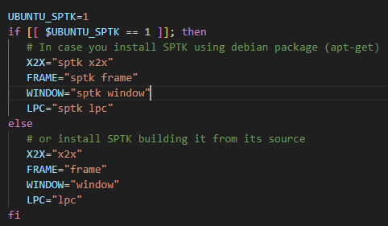

- Explique el procedimiento seguido para obtener un fichero de formato *fmatrix* a partir de los ficheros de
  salida de SPTK (líneas 49 a 55 del script `wav2lp.sh`).

  Per obtenir un fitxer en format *fmatrix* a partir dels fitxers de sortida de SPTK, primer es converteixen els coeficients LPC a text amb `x2x`, després es normalitzen i estructuren en una matriu de característiques, i finalment es guarden en un fitxer *fmatrix*. Per determinar el nombre de columnes, s'afegeix 1 a l'ordre de predicció. Per obtenir el nombre de files, es converteixen els números flotants a ASCII i es compten les files amb `wc -l`.

  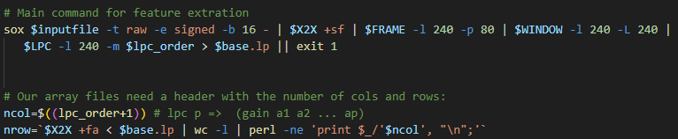

  * ¿Por qué es más conveniente el formato *fmatrix* que el SPTK?

  El format fmatrix ens permet organitzar les dades de manera més estructurada, ja que les senyals estan ordenades per trames i coeficients. En aquest format, cada fila de la matriu representa una trama de la senyal, mentre que cada columna correspon a un dels coeficients utilitzats per parametritzar aquesta trama.
  A més, l’ús de matrius facilita la selecció i manipulació de les files o columnes d’interès mitjançant la funció cut. Aquesta eina és especialment útil per aïllar parts específiques.

- Escriba el *pipeline* principal usado para calcular los coeficientes cepstrales de predicción lineal
  (LPCC) en su fichero <code>scripts/wav2lpcc.sh</code>:

  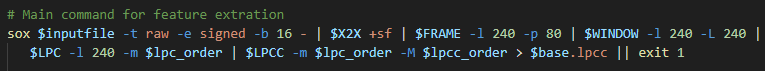

- Escriba el *pipeline* principal usado para calcular los coeficientes cepstrales en escala Mel (MFCC) en su
  fichero <code>scripts/wav2mfcc.sh</code>:

  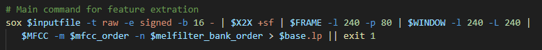

### Extracción de características.

- Inserte una imagen mostrando la dependencia entre los coeficientes 2 y 3 de las tres parametrizaciones
  para todas las señales de un locutor.

  **A la Terminal**: plot_gmm_feat -x 2 -y 3 -g blue work/gmm/lp/SES007.gmm work/lp/BLOCK00/SES007/*

  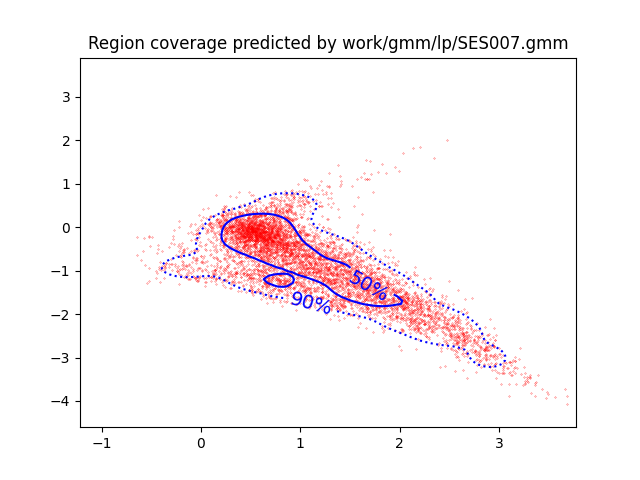

  **A la Terminal**: plot_gmm_feat -x 2 -y 3 -g blue work/gmm/lpcc/SES007.gmm work/lpcc/BLOCK00/SES007/*

  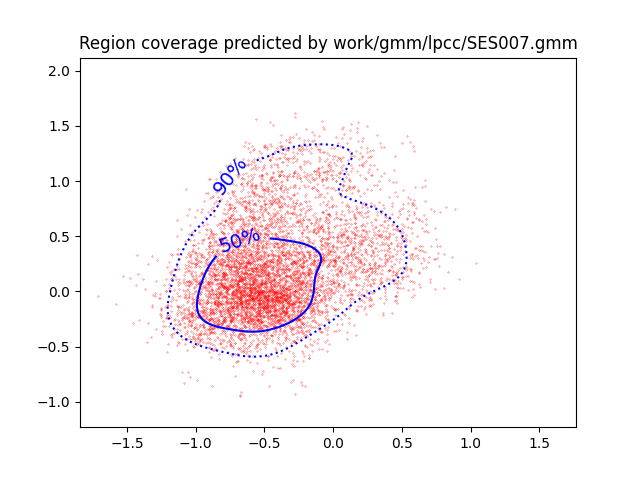

  **A la Terminal**: plot_gmm_feat -x 2 -y 3 -g blue work/gmm/mfcc/SES007.gmm work/mfcc/BLOCK00/SES007/*

  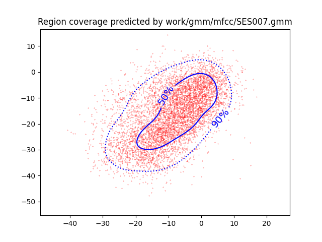

  + Indique **todas** las órdenes necesarias para obtener las gráficas a partir de las señales 
    parametrizadas.
  + ¿Cuál de ellas le parece que contiene más información?

  Les gràfiques de LPCC i MFCC presenten una correlació significativament menor en comparació amb les de LP. Això implica que els valors dels coeficients en aquests casos són menys predictibles, cosa que resulta en una major quantitat d’informació aportada per aquestes parametritzacions.

- Usando el programa <code>pearson</code>, obtenga los coeficientes de correlación normalizada entre los
  parámetros 2 y 3 para un locutor, y rellene la tabla siguiente con los valores obtenidos.

  |                        | LP   | LPCC | MFCC |
  |------------------------|:----:|:----:|:----:|
  | &rho;x[2,3] |-0.76 |0.30  |0.53  |

  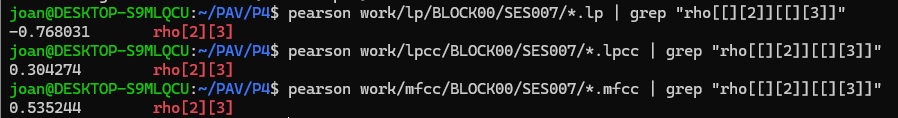
  
  + Compare los resultados de <code>pearson</code> con los obtenidos gráficamente.

  Els valors de ρx[2,3] reflecteixen la correlació entre els coeficients 2 i 3. Per a LP, el valor és més proper a 1, indicant més correlació i menys informació. En canvi, per a LPCC i MFCC, els valors són més propers a 0, mostrant menys correlació i més informació. A més, els coeficients LPCC són lleugerament més incorrelats que els de MFCC. Aquests resultats coincideixen amb les gràfiques, confirmant l’anàlisi de Pearson.
  
- Según la teoría, ¿qué parámetros considera adecuados para el cálculo de los coeficientes LPCC y MFCC?

  **LPC**: 8-14 coeficients
  **MFCC**: 13 coeficients, 24-40 filtres

### Entrenamiento y visualización de los GMM.

Complete el código necesario para entrenar modelos GMM.

- Inserte una gráfica que muestre la función de densidad de probabilidad modelada por el GMM de un locutor
  para sus dos primeros coeficientes de MFCC.

  **A la Terminal**: plot_gmm_feat work/gmm/mfcc/SES006.gmm

  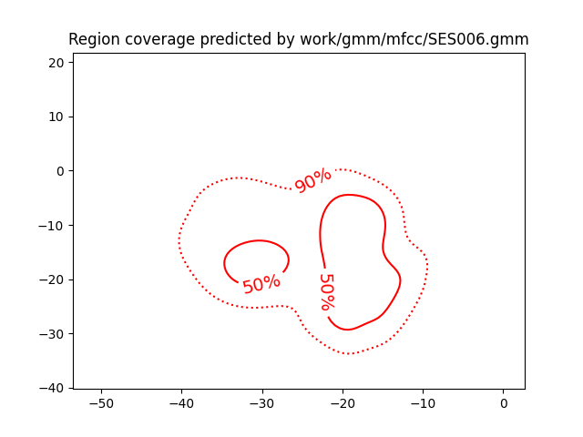

- Inserte una gráfica que permita comparar los modelos y poblaciones de dos locutores distintos (la gŕafica
  de la página 20 del enunciado puede servirle de referencia del resultado deseado). Analice la capacidad
  del modelado GMM para diferenciar las señales de uno y otro.

  **A la Terminal**: plot_gmm_feat -f blue work/gmm/mfcc/SES006.gmm work/mfcc/BLOCK00/SES006/*.mfcc

  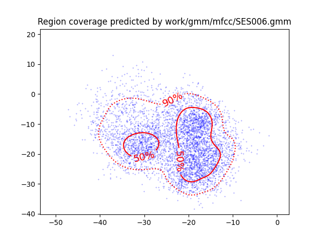

  Per un altre locutor tenim:

  **A la Terminal**: plot_gmm_feat -f blue work/gmm/mfcc/SES006.gmm work/mfcc/BLOCK00/SES008/*.mfcc

  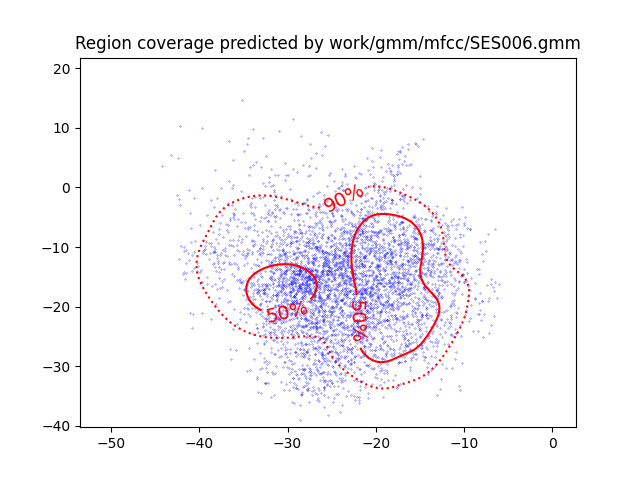

  El model GMM s’adapta millor al locutor correcte, ajustant-se més a les seves mostres, mentre que per a un locutor incorrecte hi ha més mostres fora de l’àrea del model.

### Reconocimiento del locutor.

Complete el código necesario para realizar reconociminto del locutor y optimice sus parámetros.

- Inserte una tabla con la tasa de error obtenida en el reconocimiento de los locutores de la base de datos
  SPEECON usando su mejor sistema de reconocimiento para los parámetros LP, LPCC y MFCC.

**LP**:   nerr=100	ntot=785	error_rate=12.74%
**LPCC**: nerr=6	ntot=785	error_rate=0.76%
**MFCC**: nerr=13	ntot=785	error_rate=1.66%

### Verificación del locutor.

Complete el código necesario para realizar verificación del locutor y optimice sus parámetros.

- Inserte una tabla con el *score* obtenido con su mejor sistema de verificación del locutor en la tarea
  de verificación de SPEECON. La tabla debe incluir el umbral óptimo, el número de falsas alarmas y de
  pérdidas, y el score obtenido usando la parametrización que mejor resultado le hubiera dado en la tarea
  de reconocimiento.

  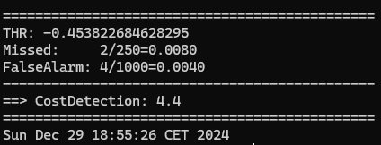
  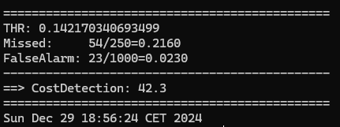
  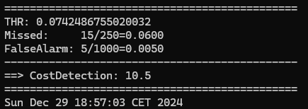
 
### Test final

- Adjunte, en el repositorio de la práctica, los ficheros `class_test.log` y `verif_test.log` 
  correspondientes a la evaluación *ciega* final.

### Trabajo de ampliación.

- Recuerde enviar a Atenea un fichero en formato zip o tgz con la memoria (en formato PDF) con el trabajo 
  realizado como ampliación, así como los ficheros `class_ampl.log` y/o `verif_ampl.log`, obtenidos como 
  resultado del mismo.
